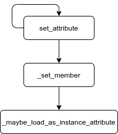
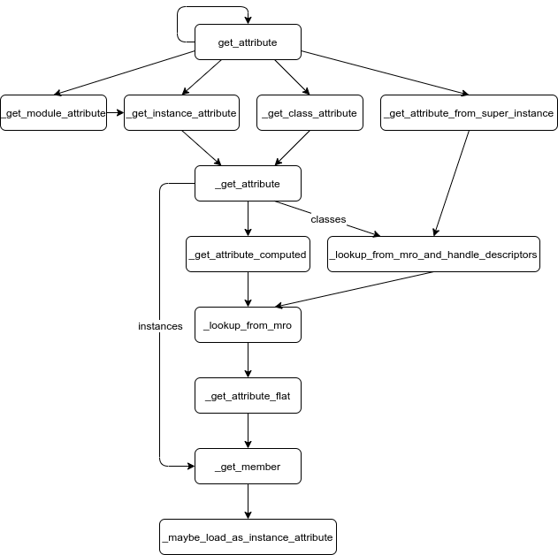

# Attributes

<!--* freshness: { owner: 'rechen' reviewed: '2021-12-09' } *-->

<!--ts-->
   * [Attributes](#attributes)
      * [Introduction](#introduction)
         * [Terminology](#terminology)
      * [Implementation](#implementation)
         * [set_attribute](#set_attribute)
         * [get_attribute](#get_attribute)
         * [get_special_attribute](#get_special_attribute)
         * [valself](#valself)

<!-- Added by: rechen, at: 2021-12-09T19:13-08:00 -->

<!--te-->

## Introduction

The [attribute] module handles getting and setting attributes on abstract
values. It is mostly used to:

* analyze the `LOAD_ATTR` and `STORE_ATTR` opcodes, and
* look up magic methods that are needed to perform certain operations - e.g.,
  `__init__` for instance creation and `__setitem__` for modifying a dictionary.

### Terminology

We will refer to the object on which an attribute is being get or set as the
*target object*.

## Implementation

`attribute` has two public methods: `get_attribute` and `set_attribute`.

### set_attribute

We'll start by looking at `set_attribute`, since it's by far the simpler of the
two top-level methods:



1. `set_attribute` recursively calls itself as needed to unpack the target
   object. For example, when passed a Union, `set_attribute` iterates through
   the union's options and calls itself on each one.
1. `set_attribute` then calls `_set_member`, which first calls
   `_maybe_load_as_instance_attribute` to make sure the requested attribute has
   been lazily loaded into the object's `members` dict, then modifies the
   appropriate `members` entry.

### get_attribute

`get_attribute` is considerably more complicated, due to the lengths it goes to
in order to emulate the behavior of the Python interpreter:



1.  Like `set_attribute`, `get_attribute` recursively calls itself to unpack the
    target object.
1.  Once the object has been unpacked, it is either a module, class instance,
    class, or super instance (the result of a `super()` call). The corresponding
    helper method is called.

    a. `_get_module_attribute` forwards to `_get_instance_attribute`.

    b. `_get_instance_attribute` and `_get_class_attribute` forward to
    `_get_attribute`.

    c. `_get_attribute_from_super_instance` determines the super class and calls
    `_lookup_from_mro_and_handle_descriptors` on it.

1.  Python classes can define a magic method, `__getattribute__`, that is called
    unconditionally to implement attribute access, as well as a fallback method,
    `__getattr__`, that is only called when normal attribute lookup fails. (See
    the [Python data model documentation][python-attribute-access] for more
    information.) To mimic this, `_get_attribute` first calls
    `_get_attribute_computed("__getattribute__")`, then calls either
    `_get_member` or `_lookup_from_mro_and_handle_descriptors` depending on
    whether the target object is a class instance or a class, and finally calls
    `_get_attribute_computed("__getattr__")`.

1.  Both `_get_attribute_computed` and `_lookup_from_mro_and_handle_descriptors`
    use `_lookup_from_mro` to do attribute lookup on a class. The latter walks
    the class's MRO, calling `_get_attribute_flat` - which in turn calls
    `_get_member` - to check for the attribute on the class and its bases.

1.  Similar to `_set_member`, `_get_member` uses
    `_maybe_load_as_instance_attribute` to force lazy loading and then checks
    the `members` dict for the requested attribute.

### get_special_attribute

Occasionally, an abstract class needs to bypass normal attribute lookup. In such
cases, the class can implement a `get_special_attribute` method whose return
value will be immediately used. For example, [HasSlots][HasSlots] returns the
custom method implementations in its slots rather than the underlying
`PyTDFunction` objects.

### valself

`attribute.get_attribute` takes an optional `valself` parameter, a binding to an
abstract value related to the target object. When to pass `valself` and what
value to use can be tricky:

* If the target object is an instance of a class, rather than a class itself,
  then `valself` is strictly optional and should be a binding to the target
  object. When given, `valself` will be included in the origins of the returned
  variable and therefore be taken into account in typegraph solver queries.
* If the target object is a class, then `valself` is interpreted roughly as
  follows:
  1. If `valself` is a binding to an instance of the target class, then the
     attribute lookup will ignore the class's metaclass. For example, with:

     ```python
     class Foo(type):
       def f(cls):
         pass
     class Bar(metaclass=Foo):
       pass
     ```
     `get_attribute(node, Bar, 'f', valself=Binding(Instance(Bar)))` will return
     `None` despite `f` existing on `Foo`. The reasoning is that if the original
     query were for an attribute `f` on an instance of `Bar`, taking the
     metaclass into account would be unexpected.
  1. If `valself` is a binding to the class, then the attribute lookup will use
     the metaclass. So `get_attribute(node, Bar, 'f', valself=Binding(Bar))`
     will return `Foo.f`, as we're treating `Bar` as not only a class but also
     an instance of its metaclass.
  1. If `valself` is `None` and we are looking up `__getitem__`, then the class
     is treated as a type annotation.
  1. Otherwise, if `valself` is `None`, then attribute lookup will behave the
     same as in case (1), except that methods will be returned unbound, since
     there is no instance of the class to bind to.

[attribute]: https://github.com/google/pytype/blob/main/pytype/attribute.py

[HasSlots]: https://github.com/google/pytype/blob/e760fd4c9f4fbfc2626db0f9a959d556e026b856/pytype/mixin.py#L128

[python-attribute-access]: https://docs.python.org/3/reference/datamodel.html#customizing-attribute-access
